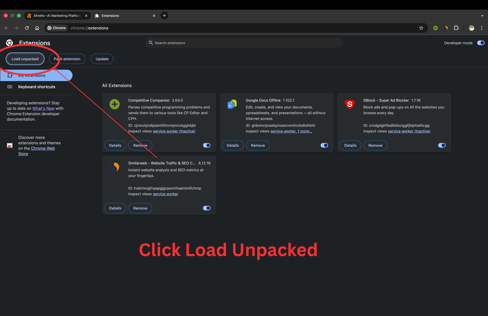
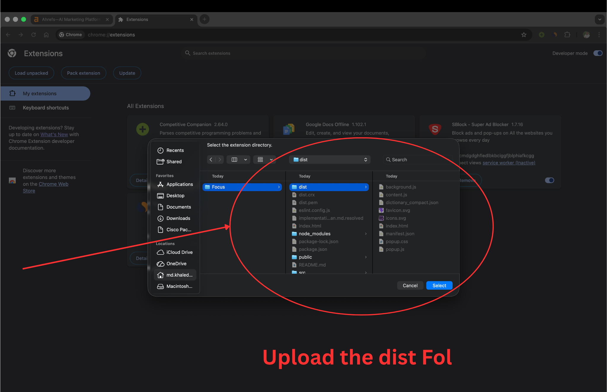
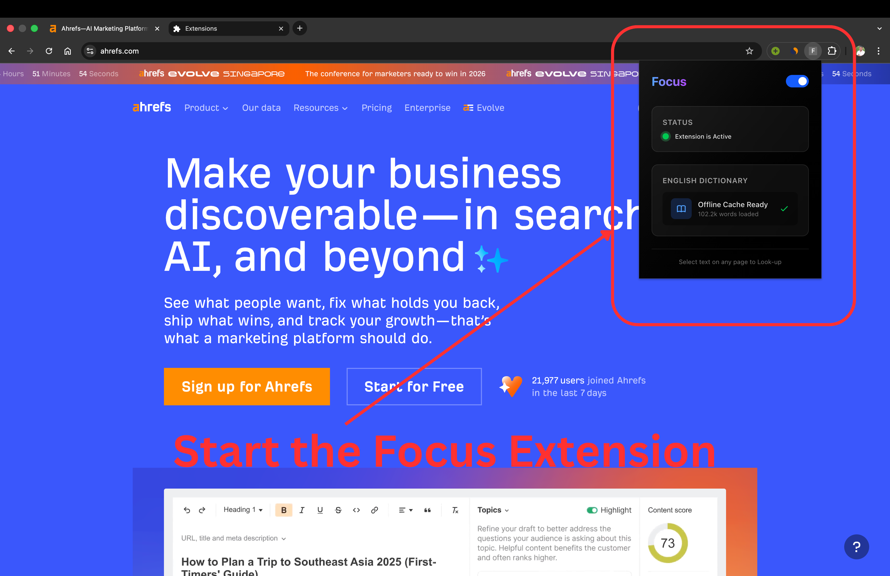
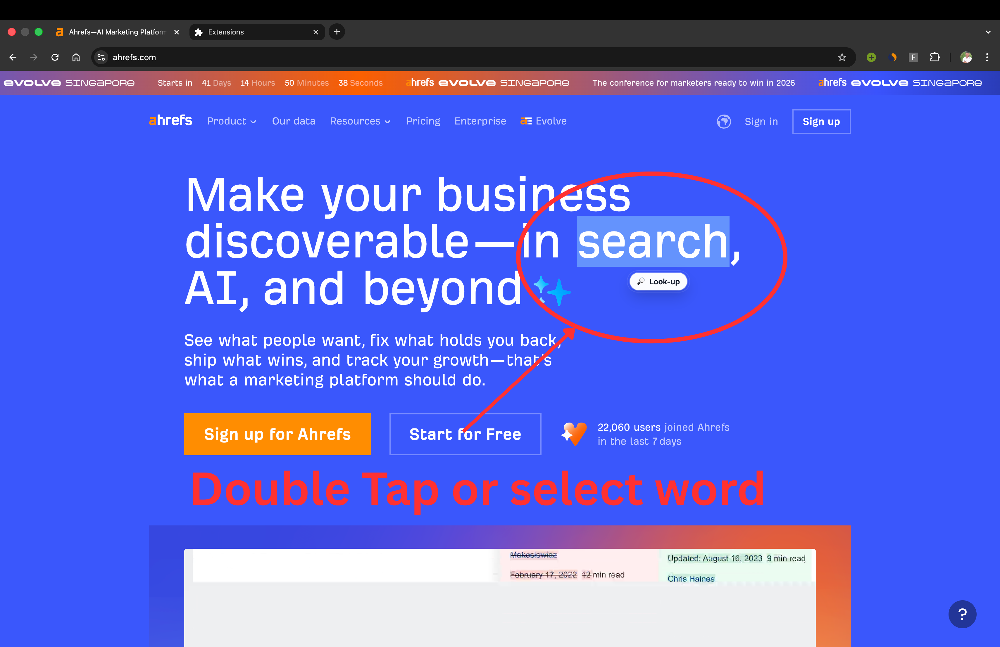
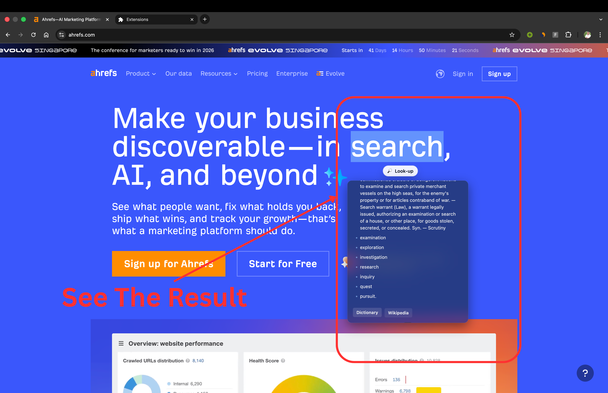

<div align="center">

<h1>🎯 Focus</h1>

<p><em>Stay in the flow. Instant word definitions — no new tab, no distraction.</em></p>

[](https://developer.chrome.com/docs/extensions/mv3/)
[](https://vitejs.dev/)
[](https://react.dev/)
[](https://www.typescriptlang.org/)
[](https://tailwindcss.com/)
[](./LICENSE.md)

</div>

---

## ✨ What is Focus?

**Focus** is a Chrome Extension built on Manifest V3 that empowers readers to look up word definitions *instantly* — directly within the page. No context switching, no new tabs. Just highlight a word, get the definition, and keep reading.

> **Philosophy:** *Minimum Distraction. Maximum Context.*

---

## 🚀 Key Features

- 📖 **Inline Definitions** — Highlight any word to reveal an elegant floating definition card, rendered directly on the page.
- ⚡ **Local-First Lookup** — Uses a bundled Webster-based `dictionary_compact.json` loaded into **IndexedDB** for near-instant lookups — no internet required.
- 🌐 **API Fallback** — Automatically queries the [Free Dictionary API](https://dictionaryapi.dev/) for words not found in the local store.
- 🧠 **Smart Caching** — An in-memory cache layer sits on top of IndexedDB to eliminate redundant disk reads during a session.
- 🎨 **Glassmorphic UI** — A polished, dark-mode aware popup and definition card with smooth animations.
- 🔒 **Privacy-First** — All local lookups are fully offline. No user data is ever transmitted unless an API fallback is triggered.
- ⚙️ **Settings Popup** — A dedicated popup UI accessible from the Chrome toolbar for extension controls.

---

## 📸 How to Use — Step by Step

> The following screenshots walk you through the full experience.

<table>
  <tr>
    <td align="center" width="50%">
      <strong>Step 1 — Load in Chrome</strong><br/>
      
      <p>Navigate to <code>chrome://extensions</code>, enable Developer Mode, and click <strong>Load unpacked</strong> → select the <code>dist/</code> folder.</p>
    </td>
    <td align="center" width="50%">
      <strong>Step 2 — Build the Extension</strong><br/>
      
      <p>Upload the dist folder you get through run <code>npm run build</code> to the chrome web store.</p>
    </td>
  </tr>
  <tr>
    <td align="center" width="50%">
      <strong>Step 3 — Extension is Active</strong><br/>
      
      <p>Focus appears in your Chrome toolbar. Click the icon to open the settings popup.</p>
    </td>
    <td align="center" width="50%">
      <strong>Step 4 — Select a Word</strong><br/>
      
      <p>Highlight any word on any webpage. A definition button will appear near your selection.</p>
    </td>
  </tr>
  <tr>
    <td align="center" colspan="2">
      <strong>Step 5 — See the Definition</strong><br/>
      
      <p>The definition card appears inline — rich, clean, and fully non-intrusive.</p>
    </td>
  </tr>
</table>

---

## 🛠️ Installation & Development

### Prerequisites

- [Node.js](https://nodejs.org/) `>=18`
- [npm](https://www.npmjs.com/) `>=9`
- Google Chrome (latest)

### 1. Clone & Install Dependencies

```bash
git clone https://github.com/<your-username>/focus-extension.git
cd focus-extension
npm install
```

### 2. Build the Extension

```bash
npm run build
```

This uses `tsc` + Vite to compile TypeScript and bundle all three entry points (`popup`, `background`, `content`) into the `dist/` folder.

### 3. Load into Chrome

1. Open Chrome and go to **`chrome://extensions`**
2. Enable **Developer Mode** (top-right toggle)
3. Click **"Load unpacked"**
4. Select the **`dist/`** folder inside the project root

> ✅ The extension will now appear in your toolbar and be active on all pages.

### 4. Development Mode (Hot Reload)

```bash
npm run dev
```

> **Note:** Vite's dev server powers the popup UI. For content script and background changes, you must rebuild and reload the extension in Chrome manually.

---

## 🏗️ Tech Stack

| Layer | Technology |
|---|---|
| Build Tool | [Vite 8.x](https://vitejs.dev/) |
| Language | TypeScript 5.9 |
| UI Framework | React 19 |
| Styling | Tailwind CSS 4.x |
| Extension API | Chrome Manifest V3 |
| Local Data | IndexedDB + In-Memory Cache |
| Dictionary Source | Webster's English (Compact JSON) + [dictionaryapi.dev](https://dictionaryapi.dev/) |

---

## 📁 Project Structure

```
focus/
├── public/
│   ├── manifest.json          # Chrome Extension manifest (MV3)
│   ├── dictionary_compact.json # Bundled Webster's dictionary (~22MB)
│   ├── favicon.svg
│   └── icons.svg
├── src/
│   ├── background.ts          # Service Worker: dictionary load, lookup, API fallback
│   ├── content.tsx            # Content Script: highlight detection, definition card UI
│   ├── App.tsx                # Popup UI: settings and status
│   ├── main.tsx               # Popup entry point
│   └── index.css              # Global styles
├── images/                    # Step-by-step screenshots
├── index.html                 # Popup HTML entry
├── vite.config.ts             # Multi-entry Vite configuration
└── package.json
```

---

## 🤝 Contributing

Pull requests are welcome! For major changes, please open an issue first to discuss what you would like to change.

---

## 📄 License

This project is licensed under the **GNU General Public License v3.0 or later (GPL-3.0-or-later)** — see the [LICENSE.md](./LICENSE.md) file for details.

---

## 🙏 Credits & Acknowledgments

Dictionary data and related resources are credited to the following sources:

- **Matthew Reagan** — [WebstersEnglishDictionary](https://github.com/matthewreagan/WebstersEnglishDictionary)
- **Project Gutenberg** — [gutenberg.org](https://www.gutenberg.org/)
- **Adam Isaacs** — [adambom/dictionary](https://github.com/adambom/dictionary)

Focus uses bundled Webster-derived local dictionary data as the primary source, and the **[Free Dictionary API](https://dictionaryapi.dev/)** as a secondary fallback for terms not present in local storage.

---

<div align="center">
  <sub>Built with ❤️ to keep you in the flow.</sub>
</div>
